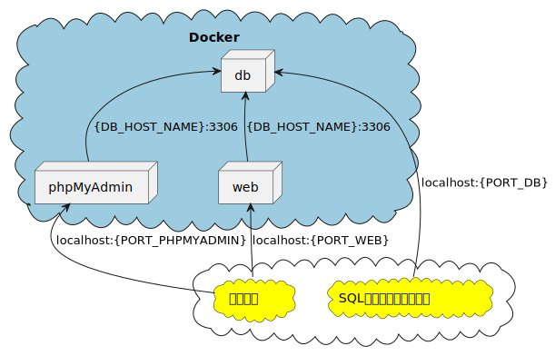

# PHP8.2環境

PHP8.2 のGitHubテンプレートリポジトリです。

## インストール

- Git (GitHub)
- Docker Desktop
- ターミナル (Windowsの場合、「PowerShell」, 「GitBash」等)
- VSCode (任意)
- SQLクライアント (任意 「A5:SQL Mk-2」、「DBeaver」等)

## テンプレート導入

導入は、ダウンロードするか、テンプレートからリポジトリを作成してください。

### ダウンロードする場合

「Code」から「Download ZIP」を選択するとダウンロードが可能です。

### リポジトリを作成する場合

#### リポジトリ作成

「Use this template」ボタンで、テンプレートから自身のリポジトリを作成してください。

- テンプレートからリポジトリを作成する
  - <https://docs.github.com/ja/repositories/creating-and-managing-repositories/creating-a-repository-from-a-template>

#### clone

自身で作成したリポジトリをcloneしてください。

- リポジトリをクローンする
  - <https://docs.github.com/ja/repositories/creating-and-managing-repositories/cloning-a-repository>

## 開発環境

Dockerを使って環境を構築します。  

### 構成図



### 構築する環境

- Webコンテナ
  - [php:8.2.0-apache](https://hub.docker.com/_/php)
  - [composer:2.3.10](https://hub.docker.com/_/composer)
- DBコンテナ
  - [mysql:8.0.29](https://hub.docker.com/_/mysql)
- phpMyAdminコンテナ
  - [phpmyadmin:5.2.0](https://hub.docker.com/_/phpmyadmin)

### .env

[.env](./.env)ファイルの各名称・ポート設定をしてください。  
基本的にはそのまま使用可能ですが、IPとポートが重複するとコンテナが起動しないので  
自身の環境に合わせて設定を変えてください。

### compose

以下のコマンドを実行します。

```bash
# ターミナルで実行
## ls コマンドで docker-compose.yml があるか確認
ls docker-compose.yml
## docker-compose で環境構築  ※ 時間がかかるので注意
docker-compose up -d
```

上記コマンドでエラーがなければ環境構築が完了しています。

### 確認

- WEB ※ ポート番号は [`.env`](./.env) の `PORT_WEB` を参照
  - <http://localhost:80/>  
    [htdocs/index.php](./htdocs/index.php)の実行結果が画面に表示されます。
- phpMyAdmin ※ ポート番号は [`.env`](./.env) の `PORT_PHPMYADMIN` を参照
  - <http://localhost:8080>

### SQLクライアント

こちらは任意です。

- `DBeaver`
  - <https://dbeaver.io/>
  - 接続情報 ※ [`.env`](./.env) の情報にあわせて設定すること
    - ドライバ名: `MySQL`
    - ServerHost: `localhost`  ～  `IP` 参照 (localhost = 127.0.0.1)
    - Port: `3306`  ～  `PORT_DB` 参照
    - Database: ※ 未入力でOK
    - ユーザー名: `root`
    - パスワード: `root`  ～  `DB_ROOT_PASSWORD` 参照
- `A5:SQL Mk-2`
  - <https://a5m2.mmatsubara.com/>
  - 接続情報 ※ [`.env`](./.env) の情報にあわせて設定すること
    - ホスト名: `localhost`  ～  `IP` 参照 (localhost = 127.0.0.1)
    - ユーザーID: `root`
    - パスワード: `root`  ～  `DB_ROOT_PASSWORD` 参照
    - ポート番号: `3306`  ～  `PORT_DB` 参照
